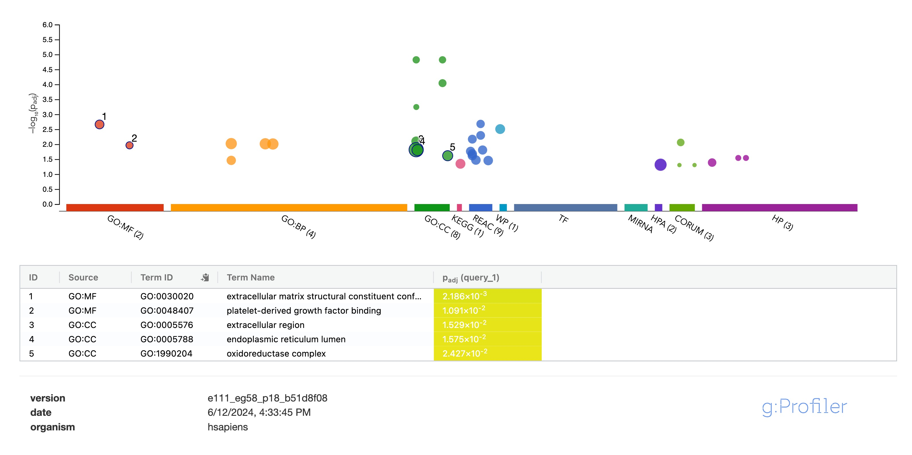

# Pathway enrichment

- gProfiler link: https://biit.cs.ut.ee/gplink/l/w37x6alGTb 





Genes:

```
ENSG00000204248 (COL11A2)
ENSG00000139219 (COL2A1)
ENSG00000261857 (MIA)
ENSG00000204228 (HSD17B8)
ENSG00000055130 (CUL1)
ENSG00000186010 (NDUFA13)
ENSG00000137070 (IL11RA)
ENSG00000180432 (CYP8B1)
ENSG00000079432 (CIC)
ENSG00000019549 (SNAI2)
ENSG00000067225 (PKM)
ENSG00000115286 (NDUFS7)
ENSG00000126522 (ASL)
ENSG00000129351 (ILF3)
ENSG00000275718 (CCL15)
ENSG00000112799 (LY86)
ENSG00000164692 (COL1A2)
ENSG00000142192 (APP)
```
